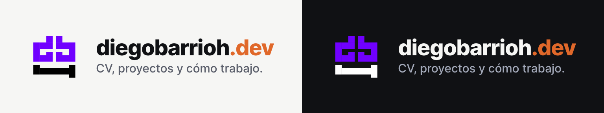
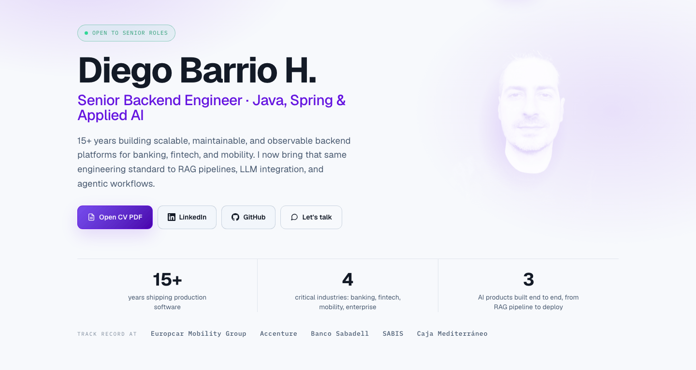
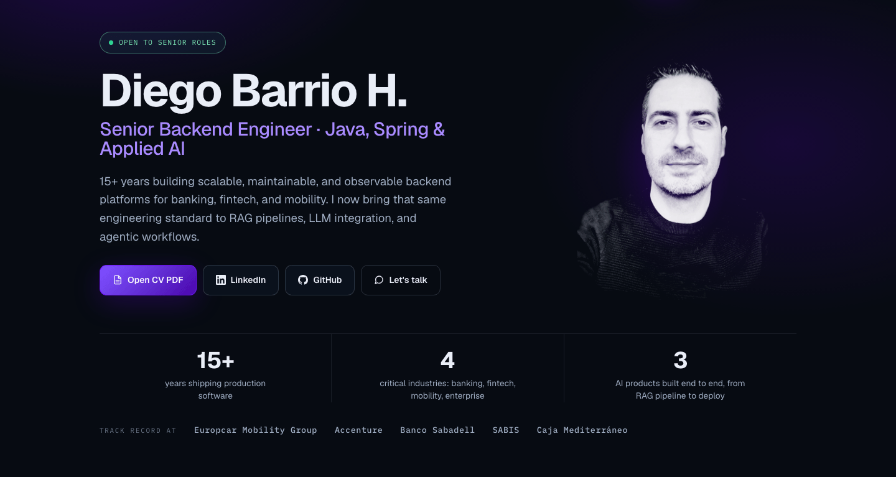
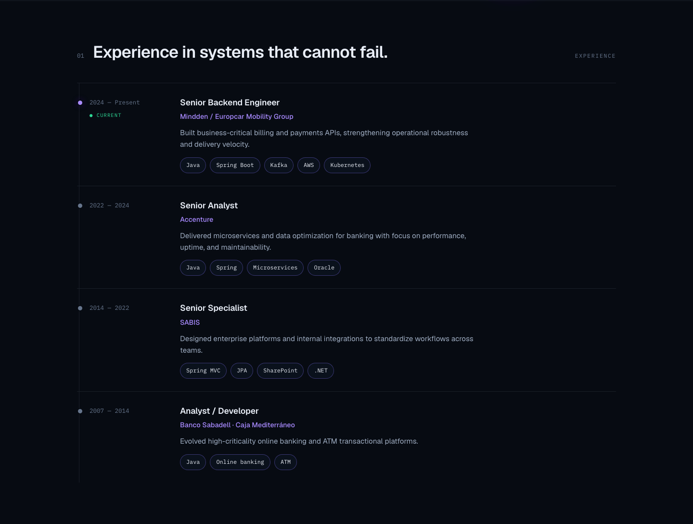
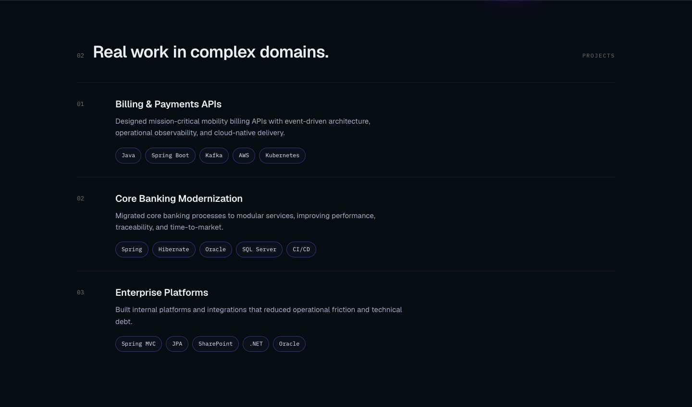

<p align="center">
  
</p>
<p align="center">
  
  
</p>
<p align="center">
  Personal CV and portfolio site. Bilingual, statically generated, and deployed to a Raspberry Pi.
</p>

<p align="center">
  <a href="https://diegobarrioh.dev">▶️ Live site</a>
  •
  <a href="https://github.com/guilu/diegobarrioh.dev">📦 Repository</a>
</p>

<p align="center">
  <a href="https://github.com/guilu/diegobarrioh.dev/stargazers"></a>
  <a href="https://github.com/guilu/diegobarrioh.dev/commits/main"></a>
  
  
  
</p>

---

## ✨ Features

- 🌍 Bilingual — English at `/`, Spanish under `/es/`, with a language toggle
- 🌗 Light and dark themes, following the OS preference and remembered in `localStorage`
- 📄 CV as a page and as a generated PDF (`npm run cv:pdf`)
- 🗂️ Projects index with a detail page per project
- 🍪 Analytics behind an explicit consent banner — reject it and no analytics cookie is ever set
- 🎯 Intent analytics that classify outbound clicks without recording the URL or the email address
- 🔎 A `sitemap.xml` and a `robots.txt` that agree with each other
- ⚡ Static output. No client framework, no CSS framework

---

## 📸 Screenshots

### Home

<p align="center">
  
  
</p>

### Experience timeline



### Projects



### Mobile

<p align="center">
  
</p>

---

## 🏗️ Tech Stack

| Piece | Version |
|---|---|
| Astro | 5.16.6 |
| `@astrojs/sitemap` | 3.7.3 |
| `@astrojs/check` | 0.9.10 |
| TypeScript | 5.9.3 |
| Styling | Vanilla CSS — a hand-rolled design system, no Tailwind, no CSS framework |

There is no client-side framework. The only JavaScript that ships is the analytics consent and intent tracking in `src/scripts/`, plus the theme and language persistence, which is an inline `<script>` in `src/layouts/BaseLayout.astro` — inline on purpose, so the stored theme is applied before first paint and the page does not flash the wrong one.

---

## 🚀 Quick Start

```bash
npm install
npm run dev
```

Then open <http://localhost:4321>.

---

## 🧱 Project Structure

```text
src/
├── components/     Card.astro, Nav.astro
├── i18n/           en.ts, es.ts, index.ts, shared.ts, types.ts
├── layouts/        BaseLayout.astro
├── pages/
│   └── [...locale]/   index.astro, about.astro, cv.astro,
│                      projects.astro, projects/[slug].astro
└── scripts/        analytics-consent.js, intent-analytics.js
```

Two things worth knowing before you go looking for them:

**Project content lives in `src/i18n/en.ts` and `es.ts`, not in a content collection.** There is a `src/content/projects/` directory, but it is an empty leftover stub wired to nothing. To add a project, you edit the i18n files.

**Every external URL is a constant in `src/i18n/shared.ts`.** One place to change a domain, which is how the links to akademia and forma moved to `backendtothefuture.com` in two lines.

---

## 🎨 Design System

[`DESIGN.md`](DESIGN.md) is the real specification for the design tokens — spacing scale, type scale, colour ramps and the light/dark mappings. Read it before changing a hex value.

---

## 🧪 Tests

```bash
npm test
```

Node's built-in runner (`node --test`), 14 tests across 3 files. They cover the parts that break quietly rather than loudly:

| File | What it guards |
|---|---|
| `analytics-consent.test.js` | Rejecting consent leaves no cookie and loads no tag |
| `intent-analytics.test.js` | Click classification never captures the URL or the email address |
| `robots.test.js` | `robots.txt` announces exactly the sitemap Search Console is configured for |

---

## ⚙️ Commands

| Command | What it does |
|---|---|
| `npm run dev` | Dev server at `localhost:4321` |
| `npm run build` | Static build into `dist/` |
| `npm run preview` | Serve the production build locally |
| `npm run check` | `astro check` — types and template diagnostics |
| `npm test` | Test suite (`node --test`) |
| `npm run cv:pdf` | Regenerate the CV PDF via `scripts/generate-cv-pdf.sh` |
| `./deploy.sh` | Build and deploy (see below) |

---

## 🚚 Deployment

No Docker and no CI. `deploy.sh` does the whole job:

1. `npm run build`
2. `rsync` of `dist/` to a staging path on the Raspberry Pi (`pi@red.local`)
3. a second `rsync` promotes staging into `/var/www/html`

The SSH key comes from `DEPLOY_KEY`, defaulting to `~/.ssh/pi_deploy_key`.

The staging hop is deliberate: rsyncing straight onto the served directory leaves a half-transferred build live for as long as the transfer takes.

---

## 🤖 Built with AI assistance

This site was built with AI assistance (`gpt-5.2-ccdex`). The architecture decisions, the design system in `DESIGN.md` and the review of every change are mine.

---

## 💖 Apoyar el proyecto

Este sitio y el resto de mis proyectos los mantengo en mi tiempo libre. Si algo de aquí te ha resultado útil:

- ⭐ Dale una estrella al repo — es gratis y ayuda muchísimo a la visibilidad
- 💛 [Conviérteme en sponsor en GitHub](https://github.com/sponsors/guilu) — soporte recurrente
- ☕ [Invítame a un café](https://buymeacoffee.com/diegobarrioh) — donación puntual
- ₿ Bitcoin on-chain (SegWit):

  ```text
  bc1qeezmht3rweypgk7a5n9uz52j52r6snfzq8e2ml
  ```

- 🐛 Abre issues o PRs con bugs, ideas o mejoras

---

## 👤 Autor

**Diego Barrio** · [diegobarrioh.dev](https://diegobarrioh.dev) · [LinkedIn](https://www.linkedin.com/in/diegobarrioh) · [GitHub](https://github.com/guilu)
